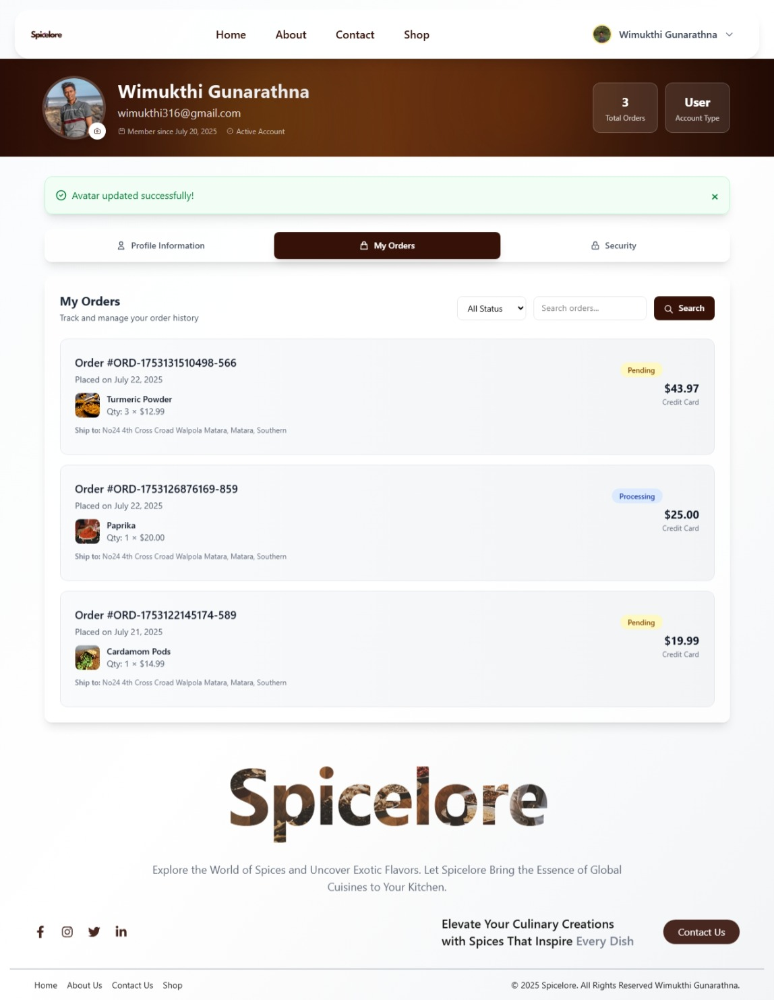

# 🌶️ Spicelore - Premium Spice E-Commerce Platform

<div align="center">


*Discover the world of authentic spices with Spicelore - your premium destination for quality spices and culinary excellence.*

[](https://developer.mozilla.org/en-US/docs/Web/JavaScript)
[](https://reactjs.org/)
[](https://nodejs.org/)
[](https://www.mongodb.com/)
[](https://expressjs.com/)

</div>

## 🎯 Overview

Spicelore is a full-stack e-commerce platform dedicated to bringing authentic, premium spices to culinary enthusiasts worldwide. Built with modern web technologies, it offers a seamless shopping experience with comprehensive inventory management and analytics.

### ✨ Key Features

- 🛒 **Complete E-Commerce Solution** - Browse, search, and purchase premium spices
- 👤 **User Authentication** - Secure registration and login system
- 📦 **Order Management** - Track orders from placement to delivery
- 📊 **Admin Dashboard** - Comprehensive inventory and sales analytics
- 💰 **Sales Tracking** - Real-time sales statistics and reporting
- 🏷️ **Category Management** - Organized spice categorization
- 👥 **Employee Management** - Staff roles and department organization
- 🔍 **Advanced Search** - Find spices by name, category, or specifications

## 🖼️ Screenshots

<div align="center">

### Home Page


### Shop


### ContactUs


### AboutUs


### Profile


### Profile


</div>

## 🏗️ Architecture

```
Spicelore Project/
├── 🖥️  backend/                 # Node.js/Express API Server
│   ├── controllers/            # Business logic controllers
│   ├── middleware/             # Authentication & validation
│   ├── models/                 # MongoDB schemas
│   ├── routes/                 # API endpoints
│   ├── utils/                  # Helper functions
│   ├── uploads/                # File storage
│   └── server.js               # Entry point
├── 🎨 frontend/                # React.js Client Application
│   ├── public/                 # Static assets
│   │   └── ProjectIMG/         # Project screenshots
│   ├── src/
│   │   ├── components/         # Reusable UI components
│   │   ├── pages/              # Application pages
│   │   └── assets/             # Images and styles
│   └── package.json
└── 📋 Documentation/
    ├── README.md               # This file
    └── SETUP_GUIDE.md          # Detailed setup instructions
```

## 🛠️ Tech Stack

### Frontend
- **React.js** - Modern UI library
- **Vite** - Fast build tool and dev server
- **CSS3** - Responsive styling
- **JavaScript ES6+** - Modern JavaScript features

### Backend
- **Node.js** - Runtime environment
- **Express.js** - Web framework
- **MongoDB** - NoSQL database
- **Mongoose** - MongoDB object modeling
- **JWT** - Secure authentication
- **bcrypt** - Password hashing

### DevOps & Tools
- **Git** - Version control
- **npm** - Package management
- **Morgan** - HTTP request logging
- **CORS** - Cross-origin resource sharing

## 🚀 Quick Start

### Prerequisites
- Node.js (v14 or higher)
- MongoDB (local or Atlas)
- npm or yarn

### Installation

1. **Clone the repository**
```bash
git clone https://github.com/Wimukthi316/Spicelore.git
cd Spicelore
```

2. **Backend Setup**
```bash
cd backend
npm install

# Create .env file
cp .env.example .env
# Configure your environment variables

# Start backend server
npm run dev
```

3. **Frontend Setup**
```bash
cd ../frontend
npm install

# Start frontend development server
npm run dev
```

4. **Seed Database** (Optional)
```bash
cd backend
node seedDatabase.js
```

### Environment Variables

Create a `.env` file in the backend directory:

```env
NODE_ENV=development
PORT=5000
MONGODB_URI=mongodb://localhost:27017/spicelore
JWT_SECRET=your_super_secret_jwt_key
JWT_EXPIRE=30d
CLIENT_URL=http://localhost:5173
```

## 📚 API Documentation

### Authentication Endpoints
- `POST /api/auth/register` - User registration
- `POST /api/auth/login` - User login
- `GET /api/auth/me` - Get current user

### Product Management
- `GET /api/products` - Get all products
- `GET /api/products/:id` - Get single product
- `POST /api/products` - Create product (Admin)
- `PUT /api/products/:id` - Update product (Admin)
- `DELETE /api/products/:id` - Delete product (Admin)

### Order Management
- `GET /api/orders` - Get user orders
- `POST /api/orders` - Create new order
- `GET /api/orders/:id` - Get order details
- `PUT /api/orders/:id/status` - Update order status (Admin)

### Inventory & Analytics
- `GET /api/inventory/stats` - Inventory statistics
- `GET /api/inventory/low-stock` - Low stock alerts
- `GET /api/sales/stats` - Sales analytics

## 🔐 Security Features

- **JWT Authentication** - Secure token-based authentication
- **Password Hashing** - bcrypt encryption for user passwords
- **Rate Limiting** - Protection against brute force attacks
- **CORS Protection** - Configured cross-origin policies
- **Input Validation** - Sanitized user inputs
- **XSS Protection** - Cross-site scripting prevention

## 🎨 UI/UX Features

- **Responsive Design** - Mobile-first approach
- **Modern Interface** - Clean and intuitive design
- **Fast Loading** - Optimized performance
- **Accessibility** - WCAG compliant components
- **User-Friendly** - Seamless shopping experience

## 🧪 Testing

```bash
# Backend health check
curl http://localhost:5000/api/health

# Test user registration
curl -X POST http://localhost:5000/api/auth/register \
  -H "Content-Type: application/json" \
  -d '{"fullName": "Test User", "email": "test@example.com", "password": "password123"}'
```

## 🤝 Contributing

We welcome contributions! Please follow these steps:

1. Fork the repository
2. Create a feature branch (`git checkout -b feature/AmazingFeature`)
3. Commit your changes (`git commit -m 'Add some AmazingFeature'`)
4. Push to the branch (`git push origin feature/AmazingFeature`)
5. Open a Pull Request

## 📄 License

This project is licensed under the ISC License - see the [LICENSE](LICENSE) file for details.

## 👨‍💻 Author

**Wimukthi316**
- GitHub: [@Wimukthi316](https://github.com/Wimukthi316)
- Project: [Spicelore](https://github.com/Wimukthi316/Spicelore)

---

<div align="center">

**Built with ❤️ for spice enthusiasts worldwide**

*Spicelore - Where every spice tells a story*

</div>
